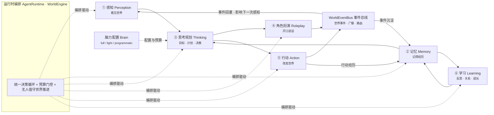

<div align="center">

<h1>HolzynActor</h1>

> **版本**：v1.0 Beta（开发者预览）
> 
> **目前处于开发阶段，功能可能有缺陷，请不要过度信任 AI，AI 可能也会出错**

<p><strong>让每一个虚构角色拥有记忆、会对话、会行动，并与整个世界一同演化。</strong></p>

<p>以一段世界观设定为起点，自动生成有身份、有记忆、会对话、会行动的智能角色，并驱动整个项目世界持续运行与演化——为 UE5 生态层提供角色行为数据。</p>

<p>
  
  
  
  
</p>

<p>
  <a href="#world"><u>活着的世界</u></a> ·
  <a href="#soul"><u>有灵魂的角色</u></a> ·
  <a href="#six-components"><u>六组件详解</u></a> ·
  <a href="#highlights"><u>亮点</u></a> ·
  <a href="#quick-start"><u>快速开始</u></a> ·
  <a href="#docs"><u>文档</u></a>
</p>

</div>

HolzynActor 是 Holzyn 全境世界生成项目中的「**NPC 角色 AI 驱动**」模块：以一段世界观设定为起点，
自动生成有身份、有记忆、会对话、会行动的智能角色，并驱动整个项目世界持续运行与演化。

它不是「能聊天的 AI 助手」，而是一套**面向无人值守持续演化的 NPC 认知闭环**——世界会自己前进，
角色会自己生活：按时作息、突发应对、记住恩怨、互相传话、随消息失真、随经历成长。

<a id="world"></a>

## 活着的世界（世界演化与游戏时间系统）

HolzynActor 里有一个**在真实时间轴上持续运转的世界**：

- **单一权威游戏时钟**：以「现实时间 × 速率」推算游戏时间，秒级推进、暂停冻结、随时调速；前端实时跳动，与后端同源换算，绝不漂移。
- **三周期显式调度**：感知每 5 游戏分钟、主决策每游戏小时、记忆与总结每游戏日——每层各司其职，长离线回来自动逐小时补齐。
- **每日世界帧体系**：每天 0 点自动生成一份「世界日报」——逐区域的天气、宏观事件、信息包、环境变化；AI 主生成 + 规则兜底双通道；重大事件可随时紧急更新，旧的帧自动归档。
- **信息扩散与三层过滤**：世界里的消息会按「距离 × 速度」在各地间传播，并由沿途居民添油加醋地**失真**；每个角色只听到「他够得着、够格听、以他的视角」的版本——谣言、悬赏、灵异传闻在村落里真实流动。
- **跨日演化与编年史**：世界事件沉淀为时间线，角色的行动、对话、记忆、关系全部可回溯。

<a id="soul"></a>

## 有灵魂的角色（实时行为决策系统）

角色不只是「每个小时例行做点事」，而是**像真人一样对世界做出即时反应**：

- **双通道决策**：周期通道管日常作息；即时通道管突发应对——听到巨响、看到火光、有人靠近，立刻放下手头的事去处理。
- **千人千面**：每次决策都会注入角色的**全量个性档案**——性格标签、五维人格数值、说话方式、核心信念、行为倾向、人际关系、时间感；面对同一件事，稳重的村长组织乡老议事，洒脱的游侠拔剑查看，缜密的医者背起药箱，谨慎的隐士按兵不动。
- **社交差异化**：反应与「你和这件事里那个人什么关系」直接挂钩——恩人相召立刻放下手头事，无关闲事选择不理会继续手头的事。
- **打断与恢复**：被打断的事情被完整记录；处理完突发事件后，角色按自己的性格决定**回去继续 / 调整安排 / 彻底放弃**——「办完事回来继续」不精分。
- **真人感细节**：状态紧急会立即行动，消息会以「当事人 → 在场者 → 全村」扩散，对熟人与陌生人态度有分寸，独处时有真实的独处行为。

<a id="six-components"></a>

## 六组件详解（★项目最大特点）

HolzynActor 把「智能」拆成六个边界清晰的组件，由运行时统一编排——每个组件只做一件事、只读自己需要的上下文、只产出可校验的结果。

### 总体闭环



### 六个组件

| # | 组件 | 一句话职责 | 关键能力 |
|---|---|---|---|
| ① | **感知 Perception** | 让 NPC「看见」世界 | 以角色视角组装世界状态（游戏时间/所在地/在场者/可见事件/关系摘要/自身状态）；【当前所见】注入决策与对话；**【世界动态】注入**（该角色当下够得着、听得到的传闻） |
| ② | **记忆 Memory** | 让 NPC「记得」经历 | 四层记忆（工作记忆 L1 / 经历记忆 L2 / 核心身份 L3 / 长期档案 L4）；Smallville 检索评分；行动/对话自动沉淀；**核心块随经历自编辑演进**；反思防叙事漂移 |
| ③ | **思考规划 Thinking** | 让 NPC「有方向」 | 单步决策（AI + Schema 校验 + 重试 + 程序化兜底）；长期目标与日计划；**实时决策通道**（刺激驱动即时反应）；**全量个性段注入**（千人千面） |
| ④ | **角色扮演 Roleplay** | 让 NPC「会说话」 | 单聊/群聊/世界演化三套 AI 编排；SSE 流式；**NPC 间自主对话**（概率闲聊 + 事件回应 + 收尾归档）；对话后自动行动评估与记忆抽取 |
| ⑤ | **行动 Action** | 让 NPC「会做事」 | 执行决策计划（改状态/写日志/广播/沉淀记忆）；计划定时执行；**打断与恢复执行**（stimulus / stimulus_resume 计划真执行，沙盘可见） |
| ⑥ | **学习 Learning** | 让 NPC「会成长」 | 反思（洞察/证据/目标复核）；动态关系与好感（对话/行动/事件三挂钩 + AI 精修 + 拓扑实时反映）；情绪评估写回 |

### 让角色真正「活」起来的系统

| 系统 | 能力 |
|---|---|
| **NPC 状态模块** | 生理四需 + 健康 + 心情 + PAD 情绪模型 + urgency 紧急度；随时间衰减、随行动恢复；AI 情绪评估写回；历史曲线可视化、实时调参 |
| **实时行为决策系统** | 刺激检测三源（状态升档/事件/他角色靠近）→ 冷却/预算/重要度仲裁 → **打断前探针（按性格是否理会）** → 即时决策（全量个性注入）→ 行动真执行 → **恢复决策三态**（回去继续/调整/放弃） |
| **世界演化与游戏时间系统** | 单一权威时钟 + 三周期调度 + 每日世界帧 + **信息扩散与三层过滤**（空间/社会/认知，消息失真随受众变化） |
| **记忆系统四层** | L1 工作记忆热缓冲 / L2 经历检索 / L3 核心块自编辑 / L4 长期档案——恒在上下文、按情境分层注入 |
| **世界沙盘** | 2D 场景可视化，角色位置/动作/想法实时流动，时钟条实时跳动，世界动态即时广播 |
| **调试前端** | 一次决策一条 trace 链路（感知→思考→行动→学习）、AI 调用详情 JSON 渲染、漂移度量、用量看板、数据库巡检 |

### 自治闭环（判定基准）

```
感知 → 思考决策 → 行动/扮演 → 世界状态变化（事件）→ 记忆 / 关系 / 反思沉淀 → 影响下一次感知
```

在「无人值守」前提下，HolzynActor 的 NPC 能形成可持续自治循环：世界时钟持续推进，角色自发决策、
自发对话、互相回应世界事件，行动与事件沉淀为记忆与关系，反思防止叙事漂移——这一切都可以在
调试前端以「一次决策一条 trace 链路」逐环节回看。

<a id="highlights"></a>

## 亮点

- **真·六组件闭环**：感知 / 记忆 / 思考 / 扮演 / 行动 / 学习六组件由运行时统一编排，NPC 真正「看见 → 想 → 说/做 → 记住 → 成长」
- **活着的世界**：单一权威时钟推动世界持续前进，每日世界帧自动生成，消息在地理上扩散并在人群口耳间失真，每个角色听到的都是「自己的版本」
- **有灵魂的角色**：面对刺激即时反应、按性格决定理会与否、处理完回到被打断的事——同一件事，稳重者组织、勇武者上前、医者救人、隐者观望，绝不千人一面
- **社交差异化**：对恩人、旧识、猜忌者的态度有分寸，关系随经历实时变化并反过来影响行为
- **有记忆的角色**：记住你说过的话、经历过的事，对话自然引用不前后矛盾；核心信念随经历演进
- **场景化世界演化**：指定场景与角色，观看一场有始有终、逻辑自洽的剧情——角色有理由登场退场，收尾自动归档为事件与记忆
- **三入口造世界**：①上传世界观文字一键 AI 解析分段；②手动填写分节；③创意发散生成（6 维世界观工作流）
- **决策链路可视化**：调试前端可查一次决策的感知→思考→行动→学习完整链路、AI 调用详情 JSON 结构化渲染与漂移度量
- **项目即文件**：整个项目可导出为一个 `.holzyn` 文件，随时携带、导入还原（可选密码加密）
- **本地优先**：数据默认存本地，无登录、无云端依赖

<a id="quick-start"></a>

## 快速开始

前置：JDK 21、Node.js 20+、Maven。

```bash
# 1. 启动后端（端口 8080，自动建库建表）
cd backend
run-mvn.bat          # 或 mvn spring-boot:run

# 2. 启动前端（端口 5174）
cd frontend
npm install
npm run dev

# 3. 打开 http://localhost:5174 → 设置本地账户 → 进入项目画廊 → 新建项目
```

### 克隆即用（换电脑 / 数据随 Git 保持一致）

> 仓库为个人私有使用：**本地数据与打包 jar 随 Git 上传**，克隆后直接运行即可看到与开发机一致的数据（项目 / 角色 / 对话 / 地点）。

```bash
git clone <仓库地址> HolzynActor && cd HolzynActor
run.bat            # 一键启动（单 jar 托管前端）
# 浏览器打开 http://localhost:8080
```

- 若 `run.bat` 提示找不到 jar（或你改了代码想更新）：先在本机执行 `build.bat`（前端构建 → 同步静态资源 → 后端打包），把生成的 jar 一起提交；
- macOS / Linux：`bash run.sh`（缺 jar 时 `bash build.sh`）；
- 全部运行方式都已把数据目录固定到仓库根 `data/`。

**数据同步约定（重要）：**

| 事项 | 说明 |
|---|---|
| 提交数据 | 停止应用 → 提交本地数据库文件与打包 jar → commit & push |
| API Key | 数据库内的 AI API Key 已加密存储；两台机器保持同一密钥即可直接使用 |
| 前端开发 | 若在另一台机器上做前端开发：`cd frontend && npm install && npm run dev`（5174） |

## 技术选型一览

| 层 | 选型 |
|---|---|
| 后端 | Java 21 · Spring Boot 4.1 · Spring Data JPA（包级功能域模块化） |
| 前端 | Vue 3 · Element Plus · Vite（features / shared 功能域重组）；独立调试前端（构建进 jar） |
| 数据库 | 本地嵌入式（主，仓库根 data/）· 远程（预留） |
| 身份 | 无登录（本地单用户），首次启动本地账户向导 |
| AI | OpenAI 兼容协议（DeepSeek / Doubao 等），主 AI 与向量化分离配置；统一埋点（scene/trace/attempt 全量详情可回放） |
| 智能体 | 六组件 + 脑力分层 + 实时决策系统 + 世界演化系统 + 记忆四层 + 事件总线 + 世界沙盘 |

## License

HolzynActor 为个人私有项目，禁止商用。
